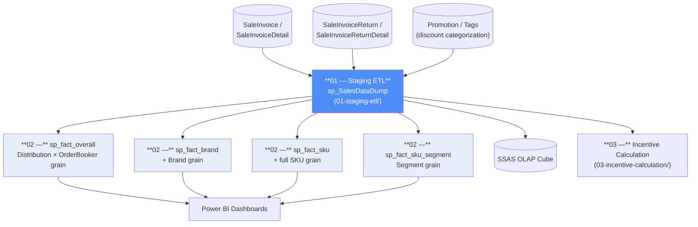

# SQL Analytics & Reporting — Staging-to-Mart ETL for FMCG Sales Analytics

A collection of production-derived (anonymized) T-SQL stored procedures implementing a **staging → multi-grain fact → BI/OLAP** pattern for FMCG secondary-sales analytics: distributor sell-out, discount/promotion breakdown, and incentive calculation.

This is not a single script — it's a small warehouse layer: one staging table absorbing raw transactional joins, and multiple pre-aggregated fact tables sized for different reporting needs, feeding both Power BI dashboards and an SSAS OLAP cube.

## Architecture



## Repository structure

```
sql-analytics-and-reporting/
├── 01-staging-etl/                  → Raw invoice/return unification into one analysis-ready staging table
│   ├── sp_SalesDataDump.sql
│   └── README.md
├── 02-fact-aggregation/             → 4 pre-aggregated fact tables at different reporting grains
│   ├── sp_fact_overall.sql
│   ├── sp_fact_brand.sql
│   ├── sp_fact_sku.sql
│   ├── sp_fact_sku_segment.sql
│   └── README.md
└── 03-incentive-calculation/        → Sales-team incentive computation stored procedure
    └── usp_rpt_IncentiveCalculation.sql
```


## Key engineering decisions

- **Staging layer isolates complexity.** A ~15-table join across live transactional tables happens once (in the staging proc), not once per downstream consumer. This keeps Power BI/cube queries fast and simple.
- **Multiple grains instead of one large table.** Rather than force every dashboard to aggregate from the lowest (SKU) grain, four fact tables are pre-built at the grains reports actually need — a direct trade-off of storage/redundancy for query speed.
- **Ratio-based discount proration.** Invoice-level promotional discounts are allocated to individual product lines proportional to volume delivered, avoiding both double-counting and silent discount loss.
- **Idempotent incremental refresh.** Every procedure deletes-then-reinserts only the current period's rows, making daily re-runs safe without full-table rebuilds.
- **Sales/return unification via sign convention.** Returns are inserted with negated volume/value columns so downstream SUM() aggregations net correctly without special-casing return rows.

## Anonymization note

Database name, and client-specific promotion/discount category names (originally tied to a specific FMCG brand's trade-marketing programs) have been genericized throughout (e.g. `RentalDiscount`, `WholesaleDiscount`, `LoyaltyProgramDiscount`, `TradeOfferDiscount`, `OffInvoiceDiscountA/B/C`). All business logic, join structure, and calculation methods are unchanged from the production versions.

## Tech stack

SQL Server (T-SQL) · Stored procedures · Star-schema-style fact modeling · Feeds Power BI & SSAS
